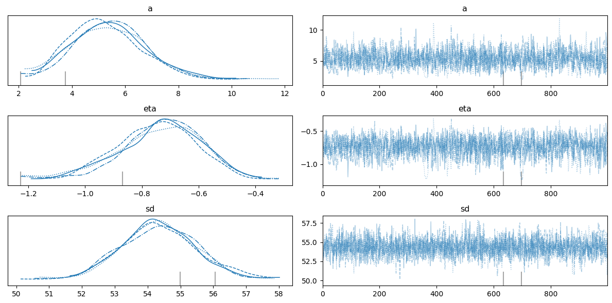

# Tutorial on the Thompson Sampling Using **Dynamic Pricing Module**

This notebook will show you on how to do the dynamic pricing model using Thompson Sampling by this dyanamic pricing module. The prior distribution this module use will follow the economic demand-pricing curve using constant-elasticity demand function. Thus, we will set and update the a, price elasticity ($\eta$), and standard deviation ($sd$) from the equation below:

$D(p) = ap^{-\eta}$

If the data doesn't fit this demand curve, it's to explore other models.

After you've installed the module, you can call the `dynamic_pricing.thompson_sample` class from the module. After that, please follow the tutorial as follow.

```python
import pandas as pd
import numpy as np
```

# 0. Dataset

The format of dataset should have at least two columns: **price** and **demand**. This shows the aggregated demand, can be in any granularity level, that we got at the price we set. Here, I have two separated dataset: `df_curr` one to set initial, another one `df_obs` is to update the prior.

```python
df_curr = pd.read_csv('dataset/thomp-samp__sales-transaction__data-current.csv')

display(df_curr.head())
print('length of the dataframe:', len(df_curr))
```

<table border="1" class="dataframe">
  <thead>
    <tr style="text-align: right;">
      <th></th>
      <th>Price</th>
      <th>Quantity</th>
    </tr>
  </thead>
  <tbody>
    <tr>
      <th>0</th>
      <td>6.13</td>
      <td>1</td>
    </tr>
    <tr>
      <th>1</th>
      <td>6.19</td>
      <td>10</td>
    </tr>
    <tr>
      <th>2</th>
      <td>6.04</td>
      <td>200</td>
    </tr>
    <tr>
      <th>3</th>
      <td>7.24</td>
      <td>2</td>
    </tr>
    <tr>
      <th>4</th>
      <td>6.19</td>
      <td>10</td>
    </tr>
  </tbody>
</table>
</div>

    length of the dataframe: 1041

```python
df_obs = pd.read_csv('dataset/thomp-samp__sales-transaction__data-observed.csv')

display(df_obs.head())
print('length of the dataframe:', len(df_obs))
```
<table border="1" class="dataframe">
  <thead>
    <tr style="text-align: right;">
      <th></th>
      <th>Price</th>
      <th>Quantity</th>
    </tr>
  </thead>
  <tbody>
    <tr>
      <th>0</th>
      <td>6.19</td>
      <td>10</td>
    </tr>
    <tr>
      <th>1</th>
      <td>6.19</td>
      <td>20</td>
    </tr>
    <tr>
      <th>2</th>
      <td>6.19</td>
      <td>10</td>
    </tr>
    <tr>
      <th>3</th>
      <td>6.13</td>
      <td>1</td>
    </tr>
    <tr>
      <th>4</th>
      <td>6.19</td>
      <td>10</td>
    </tr>
  </tbody>
</table>
</div>

    length of the dataframe: 1042

# 1. Initialize

Start by setting priors for the model parameters (e.g., demand curve parameters) based on your prior knowledge or assumptions. Here we have set the prior knowledge based on constant-demand elasticity function. We already have the data as well to update our prior. Thus, we will update our prior first based on the observed (price to demand) data that we have.

You can start by calling the `PriorIntitialization` class from the thompson sampling module.

```python
import dynamic_pricing.thompson_sample as ts
```

```python
data = df_curr                              # dataframe that contains the data
price_col = 'Price'                         # name of the price column
qty_col = 'Quantity'                        # name of the demand column
fixed_cost = 0                              # fixed cost to produce the product/service
var_cost = 4.17                             # variable cost, or others call COGS
price_point = np.linspace(1, 20, 100)       # price point for plotting price-demand and price-profit

price_prior = ts.PriorIntitialization(data, price_col, qty_col, fixed_cost, var_cost, price_point)
```

After that, we call the `intialize_prior method()` to fit and update the prior distribution with our data. Then, you can call the `investigate_prior_parameters()` method to check the result of the trace object from the updated posterior. It will result with the updated $a$, $\eta$, and $sd$ parameters.

```python
price_prior.initialize_prior()
price_prior.investigate_prior_parameters()
```
    

    
    updated a value from the result: 5.37
    updated price elasticity (eta) value from the result: -0.74
    updated standard deviation from the result: 54.34

The next step is to fit and store all the parameters needed to plot and calculate demand and profit curve using `params_for_curve()` method. Only after that, you will be able to show the demand and profit curve using the `plot_curve`. Pass **"profit"** or **"demand"** to the `curve_type` parameter to show which one you want to see.

```python
price_prior.params_for_curve()
```

```python
price_prior.plot_curve(max_curve=25, curve_type='profit')
```
 

    
```python
price_prior.plot_curve(max_curve=25, curve_type='demand')
```


    
Once fitted and updated, `PriorInitialization` is equipped with the properties to see and store the all the update prior values for:

- $a$, $\eta$, and $sd$ parameters
- Demand mean
- Profit mean
- Parameters dataframe (df)
- Price-demand at every price point we set
- Price-profit at every price point we set

This should be stored as we will pass all of these values during the Sampling Loop and Updating Prior (Posterior).

```python
a_prior = price_prior.a_prior_value[:3]
eta_prior = price_prior.eta_prior_value[:3]
sd_prior = price_prior.sd_prior_value[:3]

print('three samples of prior for a values:', a_prior)
print('three samples of prior for price elasticity values:', eta_prior)
print('three samples of prior for sd values:', sd_prior)
```

    three samples of prior for a values: [6.61314662 5.27736621 5.00816765]
    three samples of prior for price elasticity values: [-0.6282366  -0.7439304  -0.76092265]
    three samples of prior for sd values: [54.23618308 54.16537469 53.31829189]

```python
demand_mean_prior = price_prior.demand_mean_value
profit_mean_prior = price_prior.profit_mean_value

print('last 5 points of the most probable demand at every price point we set:', demand_mean_prior[-5:])
print('last 5 points of the most probable profit at every price point we set:', profit_mean_prior[-5:])
```

    last 5 points of the most probable demand at every price point we set: [0.60950924 0.60507188 0.60070998 0.59642154 0.59220462]
    last 5 points of the most probable profit at every price point we set: [9.18062514 9.22991313 9.27866345 9.32688821 9.37459915]

```python
df_params_prior = price_prior.df_parameters_value
price_demand_prior = price_prior.price_demand_dict_value
price_profit_prior = price_prior.price_profit_dict_value

print('-----')
print('parameters dataframe:')
display(df_params_prior.head())


def truncate_dict_string(dictionary, max_chars=100):
    dict_str = str(dictionary)
    if len(dict_str) > max_chars:
        return dict_str[:max_chars] + '...'
    return dict_str

print('-----')
print('pairs of price and demand:')
print(truncate_dict_string(price_demand_prior, 120))

print('-----')
print('pairs of price and profit:')
print(truncate_dict_string(price_profit_prior, 120))
```

    -----
    parameters dataframe:


<div>
<table border="1" class="dataframe">
  <thead>
    <tr style="text-align: right;">
      <th></th>
      <th>a</th>
      <th>eta</th>
      <th>sd</th>
    </tr>
  </thead>
  <tbody>
    <tr>
      <th>0</th>
      <td>6.613147</td>
      <td>-0.628237</td>
      <td>54.236183</td>
    </tr>
    <tr>
      <th>1</th>
      <td>5.277366</td>
      <td>-0.743930</td>
      <td>54.165375</td>
    </tr>
    <tr>
      <th>2</th>
      <td>5.008168</td>
      <td>-0.760923</td>
      <td>53.318292</td>
    </tr>
    <tr>
      <th>3</th>
      <td>4.949558</td>
      <td>-0.737397</td>
      <td>53.079498</td>
    </tr>
    <tr>
      <th>4</th>
      <td>4.767239</td>
      <td>-0.728548</td>
      <td>53.039644</td>
    </tr>
  </tbody>
</table>
</div>


    -----
    pairs of price and demand:
    {0: array([6.61314662, 5.92252787, 5.39228895, 4.96979047, 4.62360392,
           4.33369597, 4.08663579, 3.87304989, 3.6861...
    -----
    pairs of price and profit:
    {0: array([-20.96367478, -17.63776657, -15.0237885 , -12.89284129,
           -11.1073911 ,  -9.57921907,  -8.24881243,  -7....


# 2. Incremental Update of Prior

In using Thompson modeling, there's one key step that we have to update the posterior every single time we have new data. We can collect and observe the data in a bulk before updating it, or if we want to quickly update the prior, we can incrementally update the prior every time we have new data. It depends on the cycle of the Thompson Sampling Loop you want to do.

To do this, you can store all the values first like below.


```python
prior_params = {
    'a_prior': a_prior,
    'eta_prior': eta_prior,
    'sd_prior': sd_prior,
    'price_demand_prior': price_demand_prior,
    'price_profit_prior': price_profit_prior,
    'demand_mean_prior': demand_mean_prior,
    'profit_mean_prior': profit_mean_prior 
}

# all these parameters should be the same with the prior
fixed_cost = 0
var_cost = 4.17
price_point = np.linspace(1, 20, 100)
price_col = 'Price'
qty_col = 'Quantity'

# expect for this, where we pass the observed data
data_observed = df_obs.copy(deep=True)
```

After that, from the Thompson Sampling module, you can call `IncrementalUpdatePrior` class and pass all the parameters needed. Then, you can call the `update_prior()` method from the object to update the prior based on the data we have.


```python
price_update = ts.IncrementalUpdatePrior(prior_params, fixed_cost, var_cost, data_observed, price_col, qty_col, price_point)
price_update.update_prior()
```

Similar to `PriorInitialization` object, we can also call `investigate_posterior_parameters()` to check the updated parameters value.

```python
price_update.investigate_posterior_parameters()
```


    posterior of a value from the result: 7.07
    posterior of price elasticity (eta) value from the result: -0.59
    posterior standard deviation from the result: 56.44

The object also has `params_for_curve()` method which you have to call to be able to plot the price-profit and price-demand plot. Again, after that, you can call the `plot_prior_posterior()` to plot the profit and demand.

```python
price_update.params_for_curve()
```

```python
price_update.plot_prior_posterior(max_curve=25, curve_type='profit')
```


    
```python
price_update.plot_prior_posterior(max_curve=25, curve_type='demand')
```


    
# 3. Thompson Sampling

The last step is to do the Thompson Sampling. This is very crucial step to determine whether we will go with exploring a rather unknown reward (profit) from a new price point, or we will go by exploiting a price that we know generates the highest reward. The Thompson Sampling methods leverages the sampling from Bayesian Inference to be able to balance between exploration and exploitation.

You can call the `ThompsonSampling` class from the module and pass the variables as follows:

```python
# in thompson sampling, we used the updated posterior as the prior for the next step
# and do the sampling to know at what price should we set, whether an exploration or exploitation
a_prior = price_update.a_posterior_value
eta_prior = price_update.eta_posterior_value
sd_prior = price_update.sd_posterior_value

# value should be the same with the previous objects we defined
var_cost = 4.17
fixed_cost = 0

# new variable, to test demand at the price points we're interested in
price_to_test = [5, 10, 15, 20, 25, 30, 35, 40]

thompson_sampling = ts.ThompsonSampling(a_prior, eta_prior, sd_prior, price_to_test, var_cost, fixed_cost)
```

After that, you would be able to take one sample of point for $a$, $\eta$, and $sd$ which will be useful to calculate the demand and profit at each price point we're interested to look at. To do this, call `sampling()` method from the object.


```python
thompson_sampling.sampling()
```

    sampled values: a = 9.819448290872094 , eta = -0.3205907468514327 , sd = 55.85790743056576


Finally, you can call `calculate_rewards()` method on the object to calculate the demand and profit that might be generated from each price point. Take the one with the highest reward (profit) for the next price we should set for our product.

```python
thompson_sampling.calculate_rewards()
```

<div>
<table border="1" class="dataframe">
  <thead>
    <tr style="text-align: right;">
      <th></th>
      <th>price</th>
      <th>demand</th>
      <th>profit</th>
    </tr>
  </thead>
  <tbody>
    <tr>
      <th>0</th>
      <td>5</td>
      <td>5.861433</td>
      <td>4.864989</td>
    </tr>
    <tr>
      <th>1</th>
      <td>10</td>
      <td>4.693495</td>
      <td>27.363075</td>
    </tr>
    <tr>
      <th>2</th>
      <td>15</td>
      <td>4.121384</td>
      <td>44.634592</td>
    </tr>
    <tr>
      <th>3</th>
      <td>20</td>
      <td>3.758278</td>
      <td>59.493542</td>
    </tr>
    <tr>
      <th>4</th>
      <td>25</td>
      <td>3.498811</td>
      <td>72.880229</td>
    </tr>
    <tr>
      <th>5</th>
      <td>30</td>
      <td>3.300165</td>
      <td>85.243267</td>
    </tr>
    <tr>
      <th>6</th>
      <td>35</td>
      <td>3.141038</td>
      <td>96.838195</td>
    </tr>
    <tr>
      <th>7</th>
      <td>40</td>
      <td>3.009411</td>
      <td>107.82719</td>
    </tr>
  </tbody>
</table>
</div>

This completes the Thompson Sampling process for dynamic pricing. You can repeat the cycle to continue updating the pricing model.
